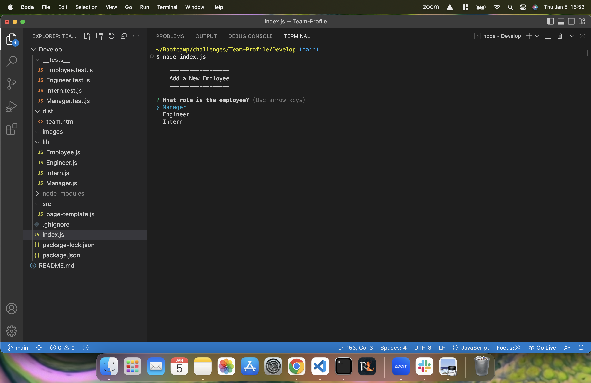
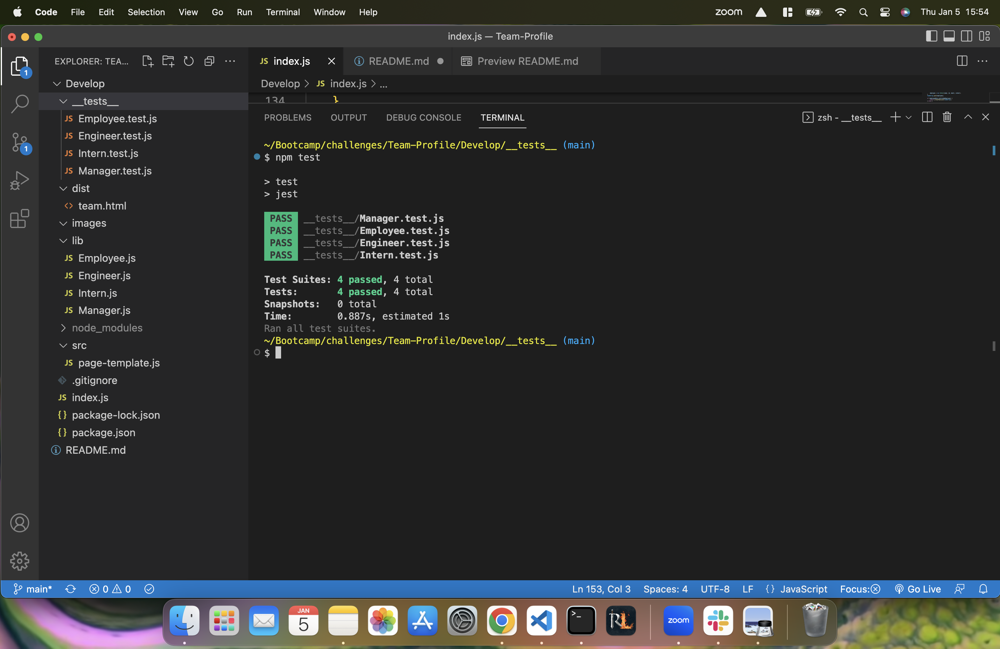

# Team Profile Generator
  
  
## Description
  Your challenge is to build a Node.js command-line application that takes in information about employees on a software engineering team and generates an HTML webpage that displays summaries for each person. As a manager I want to generate a webpage that displays my team's basic info so that I have quick access to their emails and GitHub profiles.
  
## Table of Contents
- [Installation](#installation)
- [Tests](#tests)
- [License](#license)
- [Visuals](#visuals) 
- [Questions](#questions)
  
## Installation
  Inquirer, Node, Tests

## Tests
  npm test

## License
  MIT
  
## Visuals

## Questions
  If you have any questions, or have the need to contact me, my email is Cory.Pendergraft81@gmail.com or you can find my Github Profile here at https://github.com/CoryPendergraft0. Thanks for viewing!
